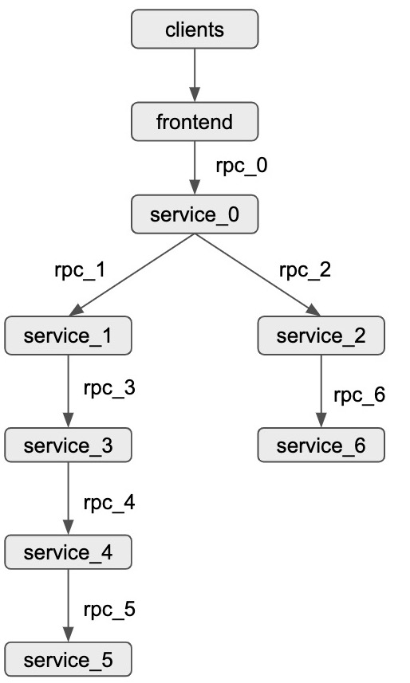

# five_tier_grpc

## Prerequisite

### Docker

### Docker Compose

## Topology



## Usage

```
docker-compose up
```

### Scripts

cpu/perf/latency_process.py: process cpu/perf/latency data

run_perf.py: launch service (pin core), launch workload generator(wrk2), launch inferfence and data collection scripts, collect latency data

monitor.py: collect perf data

read_metrics: collect cpu data

cpu_intensive.py: cpu interference
